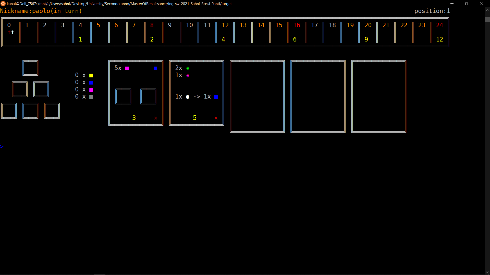
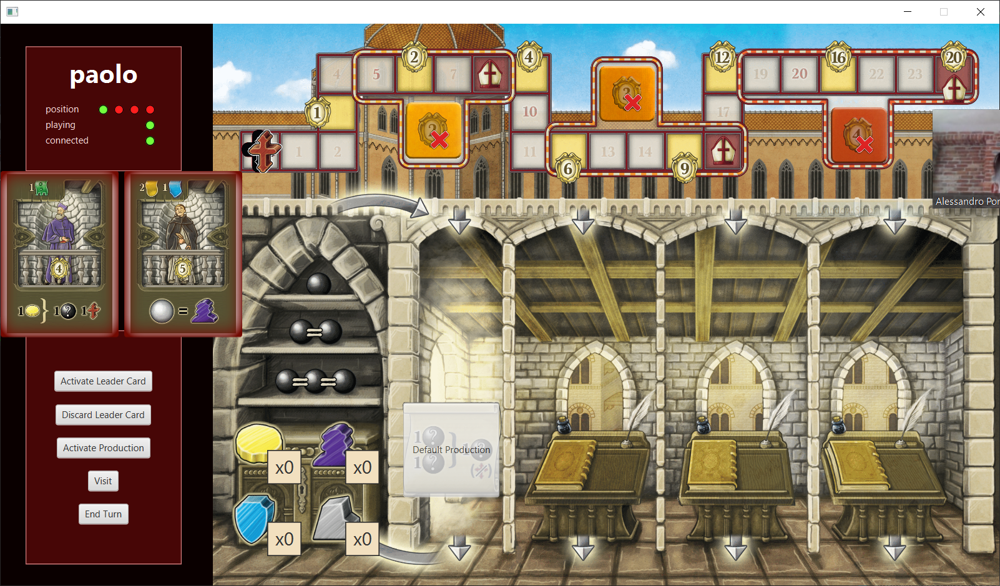

# Software engineering final project A.A 2020-2021


**Professor**: Gianpaolo Cugola

**Group:** GC17

**Students**:
- Kunal Sahni (immatriculation number: 932018)
- Alessandro Ponti (immatriculation number: 910336)
- Vittorio Rossi (immatriculation number: 911631)

**Final Score**: 30/30 cum laude

## Implemented features

| Feature | Implemented |
| ------- | ----------- |
| All basic rules ("Regole complete") | :heavy_check_mark: |
| CLI | :heavy_check_mark: |
| GUI | :heavy_check_mark: |
| Socket | :heavy_check_mark: |
| Advanced functionality 1 (FA 1) | :heavy_check_mark: Multiple matches ("Partite multiple") |
| Advanced functionality 2 (FA 2) | :heavy_check_mark: Persistence ("Persistenza") |
| Advanced functionality 3 (FA 3) | :heavy_check_mark: Resilience to disconnections ("Resilienza alle disconnessioni") |

## Project specification
The project consists of a Java version of the board game *Masters of Renaissance*, made by Cranio Creations.

You can find more about it [here](https://craniointernational.com/products/masters-of-renaissance/).

The repository includes:
* source code of implementation
* source code of unit tests
* initial UML diagrams
* auto-generated final UML diagrams
* working game implementation compliant to project requirements
* ready to use jar for server, CLI and GUI

## Testing

Extensive tesing was performed on each part of the project, specifically with the help of unit testing for server components (Model, Controller) and with manual testing on all parts of the project.
Unit tests cover 100% of classes contained in controller and model, with a 92% line coverage. 

Other unit tests were written for user actions (it.polimi.ingsw.network.clienttoserver.action), which are a key part of our controller, these tests have a class coverage of 100% and a line coverage of 92%.

Testing on client side was done through quality assurance since unit testing would've consisted in mocking UI-specific functions.

## Compile

To run the tests and compile the software:

1. Install [Java SE 15](https://docs.oracle.com/en/java/javase/15/)
2. Install [Maven](https://maven.apache.org/install.html)
3. Clone this repo
4. In the cloned repo folder, run:
```bash
mvn package
```
5. The compiled artifact ('MastersOfRenaissance.jar') will be inside the `target` folder.

## Quick start guide

The following command is meant to be run inside the [`deliverables/final/jar`](./deliverables/final/jar) folder.

### Windows/Linux

1. In a terminal window, run:
```bash
java -jar MastersOfRenaissance.jar
```
2. Select the option based on output (0 for server, 1 for CLI, 2 for GUI)

Keep in mind that by default the server will use the machine's IP address and will be on port 8080. Use this information to connect from CLI or GUI.

Warning: keep in mind that CLI was implemented to function on Linux, in order to run it on Windows you should use WSL (https://github.com/ingconti/W10JavaCLI)
A minimum size of 126 columns and 25 lines is required in order to correctly view the CLI.





## Development

The software has been written using [Java SE 15](https://docs.oracle.com/en/java/javase/15/).

The IDE used for the development is [IntelliJ Idea](https://www.jetbrains.com/idea/) 2021.1.
